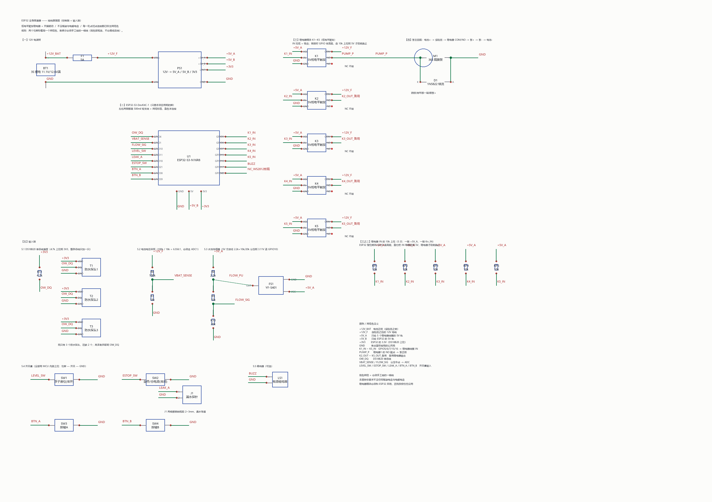

# 原理图源文件（嘉立创EDA 可直接导入）



## 为什么是 KiCad 旧版格式

你要的 `.schematic`，实际对应的是 **KiCad / EESchema 原理图**。查过嘉立创EDA的导入文档：

> 「嘉立创EDA支持KiCAD文件导入，但是**仅支持 KiCAD v4.06 及以上版本**的文件。」
> 「**KiCAD v5.1.3 后的版本文件格式有更新，可能会导入失败**，建议先用低版本保存再导入试试。」
> 「导入的KiCAD文件需要先**压缩为zip格式**，然后再导入。」
> 「如果要导入原理图，则压缩包内**需要包含库文件或库文件夹**。」

所以这里生成的是 **v4 的 `.sch` + `.lib`**，并已经打好 zip。不用 `.kicad_sch`（那是 v6+ 的新格式，可能导入失败）。

## 文件

| 文件 | 说明 |
|---|---|
| `body-cooler.sch` | 原理图主体，EESchema v4 文本格式 |
| `body-cooler.lib` | 自定义符号库（15 个符号全在里面） |
| `body-cooler-cache.lib` | 工程缓存库，内容和上面一样 —— 导入时靠它认符号 |
| **`body-cooler-kicad.zip`** | ★ **导入用这个**（`body-cooler/` 目录 + 三个文件） |
| `make_schematic.py` | 生成器，改参数重跑即可 |
| `render_schematic.py` | 用自己的数据画 PNG 预览（不依赖 EDA 软件） |

## 导入步骤

### 嘉立创EDA 标准版
1. 顶部菜单 **文件 → 导入 → KiCAD**
2. 选 `body-cooler-kicad.zip`（**必须是 zip，不能直接选 .sch**）
3. 导入后会把 PWR_FLAG 之类转成元件，要删就删

### 嘉立创EDA 专业版
1. **文件 → 导入 → KiCad**，同样选 zip

### 或者用 KiCad 自己打开
直接开 `body-cooler.sch` 即可（KiCad 5/6/7/8 都能读 legacy 格式并自动迁移）。

## 这张图遵守的规则

1. **每一处点对点连接都有网络标签** —— 两个引脚标着同一个名字，就表示必须手工接的一根线。
2. **不含任何陶瓷电容与电解电容**（按你的要求去掉了分压旁路电容、泵端子高频电容、5V 轨储能电容）。
3. 继电器按**低电平触发 + 开漏驱动**画：吸合推低 0V，释放引脚高阻、由 10k 上拉到 5V。
4. 泵的电流路径上**只有保险丝和继电器触点**，中间没有任何降压板。

## 网络名一览

| 网络 | 含义 | 连接的两端 |
|---|---|---|
| `+12V_BAT` | 电池正极（保险丝之前） | BT1.+ ↔ F1.1 |
| `+12V_F` | 保险丝之后的 12V 母线 | F1.2 ↔ PS1.VIN+ / K1~K5.COM / R6.1 |
| `+5V_A` | 只给继电器线圈的 5V 轨 | PS1.3 ↔ K1~K5.VCC / RP1~RP5.1 / R8.1 / FS1.VCC |
| `+5V_B` | 只给 ESP32 的 5V 轨 | PS1.4 ↔ U1.5V |
| `+3V3` | 3.3V | PS1.5 ↔ U1.3V3 / R11.1 / T1~T3.VDD |
| `GND` | 单点星形接地的公共地 | 多处 |
| `K1_IN`~`K5_IN` | GPIO5/6/7/15/16 → 继电器线圈 IN | U1 ↔ K1~K5.IN，并经 RP1~RP5 上拉到 +5V_A |
| `PUMP_P` | 继电器1 的 NO 触点 → 泵正极 | K1.NO ↔ M1.+ |
| `K2_OUT`~`K5_OUT_备用` | 备用继电器输出 | K2~K5.NO |
| `OW_DQ` | DS18B20 单总线 | U1.GPIO4 ↔ R11.2 ↔ T1~T3.DQ |
| `VBAT_SENSE` | 电池分压中点 → ADC | R6.2 ↔ R7.1 ↔ U1.GPIO1 |
| `FLOW_PU` | 水流分压上节点 | R8.2 ↔ R9.1 ↔ FS1.OUT |
| `FLOW_SIG` | 水流分压中点 → ADC | R9.2 ↔ R10.1 ↔ U1.GPIO10 |
| `LEVEL_SW` | 浮子液位开关 | SW1.1 ↔ U1.GPIO11 |
| `ESTOP_SW` | 急停/总电源开关（常闭） | SW2.1 ↔ U1.GPIO21 |
| `LEAK_A` | 漏水探针 | J1.1 ↔ U1.GPIO18 |
| `BTN_A` / `BTN_B` | 按键 A / B | SW3.1 / SW4.1 ↔ U1.GPIO38 / GPIO39 |
| `BUZZ` | 有源蜂鸣器 | LS1.+ ↔ U1.GPIO17 |

## 元件清单

| 位号 | 型号 / 值 | 说明 |
|---|---|---|
| U1 | ESP32-S3-DevKitC-1 (N16R8) | 主控（图上只画了本项目用到的 18 个脚） |
| BT1 | 3S 锂电 11.1V / 12.6V 满 | |
| F1 | 5A 保险丝 | 泵主回路 |
| PS1 | 12V → 5V_A / 5V_B / 3V3 降压模块 | |
| K1~K5 | 5V 光耦继电器模块，低电平触发 | K1 驱动水泵，K2~K5 备用 |
| RP1~RP5 | 10k | 继电器 IN 上拉到 +5V_A |
| M1 | 365 隔膜泵 | |
| D1 | 1N5822 肖特基 | 续流，阴极朝泵正极 |
| R11 | 4.7k | DS18B20 总线上拉（只加一只，拉到 3V3） |
| T1~T3 | DS18B20 防水探头 | 项目共需 5 个，现只有 3 个 |
| R6 / R7 | 100k / 18k | 电池分压，比 6.556:1 |
| R8 / R9 / R10 | 2.2k / 10k / 20k | 水流传感器分压 |
| FS1 | YF-S401 水流传感器 | |
| SW1 | 浮子液位开关（常开） | |
| SW2 | 急停 / 总电源开关（常闭） | 失效安全：按下和线断是同一种结果 |
| SW3 / SW4 | 轻触按键 | 固件暂未使用 |
| J1 | 漏水探针（两根裸铜线，间隔 2~3mm） | |
| LS1 | 有源蜂鸣器 | 可选 |

## 生成器自检

`make_schematic.py` 跑完会自动校验，当前结果：

```
符号 15  元件 32  导线 101  标签 94  引脚 108
悬空导线端点 0
未标注的 T 形接点 0
未接线引脚 5   [K1.NC K2.NC K3.NC K4.NC K5.NC]   <- 继电器常闭触点，故意不接
交叉(不相连) 0
```

校验内容：

* **悬空导线端点** —— 有没有画了线但两头都没接到东西（会变成飞来线）
* **未标注的 T 形接点** —— 端点落在别的线上却没标签，容易看漏
* **未接线引脚** —— 除故意留空的 NC 外都应为 0
* **交叉** —— 两条正交线段内部交叉（不算连接，但太多说明版面乱）

## 重新生成

```powershell
.venv\Scripts\python.exe .\projects\body-cooler\hardware\make_schematic.py
.venv\Scripts\python.exe .\projects\body-cooler\hardware\render_schematic.py
```

几何全在 `make_schematic.py` 里：

| 位置 | 内容 |
|---|---|
| `SYMS` 定义段 | 15 个符号的图形与引脚（引脚表同时用于连线和自检） |
| 版面段 | 每个元件的坐标、导线、网络标签、注释 |

想改引脚、加符号、挪位置，改完重跑；自检会告诉你有没有画错。

